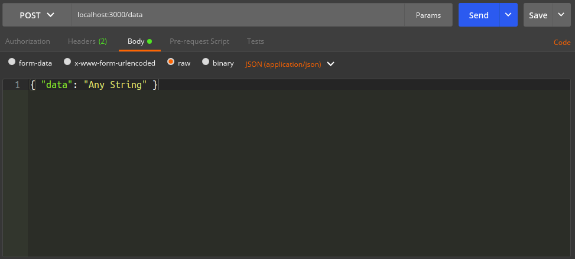

## Task 1 Tutorial

##### 1. Initialize your project
* Create a folder for your project called `task-1`.
* Open your command line inside the `task-1` folder.
* In the commmand line type:
    ```bash
    npm init
    ```
*This will initialize your project and will ask to provide information about your project. Don't think about it too much for now, you can skip some or all the answers.*
* This will also create a `package.json` file that will be like a map of your app.

##### 2. Initialize your git repository
*Git will help you keep track of your app, save different versions of your work and push your code to Github or your service of choice.*
* Open your command line inside the `task-1` folder and run:
    ```bash
    git init
    ```
* Now you can commit and push your code. If you don't know what this means click on this [link](https://try.github.io) to learn about it, this will be very important in this course and your developer career.

##### 3. Install NPM modules
*The NPM modules will ease some tasks inside your app, for now you will use just two.*
* Open your command line inside the `task-1` folder and run:
    ```bash
    npm install express body-parser --save
    ```
* You just installed `express` and `body-parser`, this is what they do.
    * Express: A framework that provides many features for web applications.
    * Body Parser: Parse incoming requests and makes them available under the `req.body` property.
##### 4. Create your server
* Inside your `task-6` folder create a file called `index.js`
* Bring `express` and `body-parser` to `index.js`.
    ```javascript
    const express = require('express');
    const bodyParser = require('body-parser');
    ```
* Create your app variable and initialize body parser.
    ```javascript
    const express = require('express');
    const bodyParser = require('body-parser');
    // Here!
    const app = express();
    app.use(bodyParser.json());
    ```
* Now create an GET API that returns `{ status: 'success' }`.
    ```javascript
    app.get('/', (req, res) => {
        res.json({ status: 'success' });
    });
    ```
* Tell your app listen for requests.
    ```javascript
    // first argument is the port, the second one a callback
    app.listen(3000, () => console.log('Listening on port 3000'));
    ```
* Now on the command line run:
    ```bash
    node index.js
    ```
* If everything went well you should see a `Listening on port 3000` in the command line.
* Now in your browser navigate to [localhost:3000](http://localhost:3000).
* You should see:
    ```javascript
    {"status":"success"}
    ```
*Good job, your first server is looking good.*

##### 5. Create a POST API.
*It should take the body of the request* (in this case `{ data: 'Any String }`) *and return the same object.*
* Inside your `index.js` file create your second API.
    ```javascript
    // Other code
    // variable should be outside of the API's scope.
    let data = null;
    
    app.post('/data', (req, res) => {
        // We assign the body of the request to the data variable.
        data = req.body;
        // We send the data variable in the response.
        res.json(data);
    });
    
    app.listen(3000, () => console.log('Listening on port 3000'));
    ```
    
* To test POST requests we need a app called Postman. Download it here [getpostman.com](https://www.getpostman.com)
* Once downloaded open the app and change the following parameters:
    * Method from **GET** to **POST**.
    * Url to http://localhost:3000/data.
    * In the **body** tab select **raw** and **JSON(aplication/json)**.
* Input the following data inside the body.
    ```json
    { "data": "Any String" }
    ```
    
* Make sure your server is running and hit "SEND".
* If you scroll down you should see this in the body of the response:
    ```json
    {
    "data": "Any String"
    }
    ```
##### 10. You are doing great! Now let's make our last GET API.
*This one will get the data we saved in our POST request. It looks something like this*
```javascript
app.get('/data', (req, res) => {
    // data comes from the variable we declared and mutared earlier
    res.json(data);
})
```
* Before testing this route you should execute your previous POST API.
* To test this API simply go to [http://localhost:3000/data](http://localhost:3000/data).
* You should see the following:
    ```json
    {"data": "Any String"}
    ```
##### 6. Wrapping up
*So this is a simple server that doesn't do that much, but don't worry we have a long way to go.*