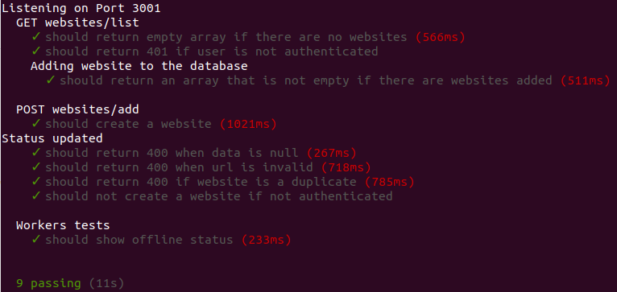

# Task 10 Tutorial
*In this you will create workers that will perform actions on schedule. To achieve this you will use the* `cron` *module.*

##### 1. First worker
* Install `cron`, in the command line run.
    ```bash
    npm install cron
    ```
* Inside your root folder create a folder called `workers`.
* Inside `workers` create a file called `uptime.js`.
* Inside `workers/uptime.js` copy the following code.
    ```javascript
    // Require cron
    const CronJob = require('cron').CronJob;
    
    // Set up the function to run once every minute
    new CronJob('* * * * *', function() {
      console.log('You will see this message every minute');
    }, null, true);
    ```
* Time to test, on the command line run.
    ```bash
    node workers/uptime
    ```
* You should see something like this, that will continue to print every minute.

    

##### 2 Check uptime
*Now you will use the worker to check if the website in the database are online. You will use the* `request` *to check the status of each website.*

* Install request, on the command line run.
    ```bash
    npm install request
    ```
* Now inside `uptime.js` add the following code.
    ```javascript
    const CronJob = require('cron').CronJob;
    // Require request module
    const request = require('request');
    // bring the Website models
    const models = require('../models');
    
    // Execute every minute
    new CronJob('* * * * *', function() {
        // Return all websites
        models.Website.findAll({})
            .then(websites => {
                // Map all websites
                websites.map(website => {
                    // Request each website
                    request(`http://${website.dataValues.url}`, function (error, response, body) {
                    // If status is not 200 website is down
                    if((response && response.statusCode) !== 200 && website.dataValues.status === 'online') {
                        // Update website's status to offline
                        models.Website.update(
                            {status: 'offline'},
                            { where: { id: website.id }})
                        .then(result => console.log(result))
                        .catch(err => console.log(err));
                        }
                    })
                })
            })
            .catch(err => console.log(err));
    }, null, true);
    ```
* On the command line run.
    ```bash
    npm install request
    ```
* Every minute the worker will update any website's status to offline if you don't get 200 as the response status code, only if the status is "online".

##### 3. Tests
*Let's write tests for your worker.*

* Modify `workers/uptime.js` in order to be able to export it.
    ```javascript
    // Require request and modules
    const request = require('request');
    const models = require('../models');
    
    // Export a function
    module.exports = function(cron){
        // Function that checks website's status
        function changeStatus(){
             models.Website.findAll({})
            .then(websites => {
                websites.map(website => {
                    request(`http://${website.dataValues.url}`, function (error, response, body) {
                    if((response && response.statusCode) !== 200 && website.dataValues.status === 'online') {
                        models.Website.update(
                            {status: 'offline'},
                            { where: { id: website.id }, returning: true})
                        .then(result => console.log('Status updated'))
                        .catch(err => console.log(err));
                        }
                    })
                })
            })
            .catch(err => console.log(err));
        }
        
        // Create worker
        let statusJob = new cron.CronJob({
            cronTime : '* * * * * *', // Run every minute
            onTick : changeStatus, // Function to run every minute
            start : false // Start rigth away
        });
        
      // Return worker
      return statusJob;
    
    }
    ```

* Now let's bring the worker to `test/test.js`.
    ```javascript
    // Other code
    
    // Require sinon, cron and the worker
    const sinon = require('sinon');
    const cron = require('cron');
    const statusJob = require('../workers/uptime')(cron);
    
    // Other code
    
    describe('GET websites/list', () => {
        before(done => {
            sequelize.sync({ force: true })
            .then(() => {
                chai.request(app)
                .post('/users/signup')
                .send(newUser)
                .end((err, res) => {
                    token = `Bearer ${res.body.session}`;
                    // Start worker
                    statusJob.start();
                    done();
                })
    
            })
            .catch(err => done(err));
        })
    
    // Other code
    
    // New describe for the worker test
    describe('Workers tests', () => {
        before(done => {
            // Fake clock
            let clock = sinon.useFakeTimers();
            
            // Fake 2 minutes
            clock.tick(120000);
            // Stop worker
            statusJob.stop();
            // Restore time
            clock.restore();
    
            done();
        })
    
        it('should show offline status', done => {
            
            // Find website that is supposed to be offline
            models.Website.find({
                where: {
                    url: 'www.test23251.com'
                }
            })
            .then(website => {
                expect(website.status).to.equal('offline');
                done();
            })
            .catch(err => done(err));
        })
    });
    ```

* Run `npm test` on the command line, you should see something like this.



##### 4. Wrapping up
*You just created your first worker, congratulations and let's continue on. You are almost there.*