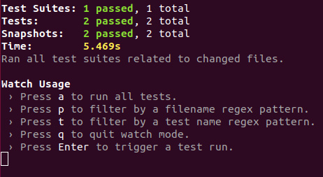

# Task 5 Tutorial
*In this tutorial we will use  Storybook and Jest to create tests for our React app.*

##### 1. Setting up Storybook
*Sometimes Storybook can be complicated to set up, specially when we have Redux like in our app. But don't worry just follow these steps and you will be good.*
* Install `storybook`.
    ```javacript
    npm i --save-dev @storybook/react
    ```
* Make sure that you have react, react-dom, and babel-core in your dependencies as well because we list these as a peerDependency.
    ```javascript
    npm i --save react react-dom
    npm i --save-dev babel-core
    ```
* Add a `storybook` script in your `package.json`.
    ```javascript
    "scripts": {
    "storybook": "start-storybook -p 9001 -c .storybook"
    }
    ```
* Inside your root folder create a folder called `.storybook`.
* Create a file called `config.js` inside `.storybook` and copy the following code.
    ```javascript
    import { configure } from '@storybook/react';
    
    function loadStories() {
        const req = require.context('../src', true, /.stories.js$/);
        req.keys().forEach((filename) => req(filename));
    }
    
    configure(loadStories, module);
    ```

##### 2. Setting up the Redux store
*Before you write your stories you need to do some changes in our Redux setup*
* First we will create a `configureStore` function which encapsulates our store creation logic.
* Inside `src` create a file called `configureStore.js` and copy the following code.
    ```javascript
    import { applyMiddleware, compose, createStore } from 'redux'
    import ReduxPromise from 'redux-promise';
    
    import rootReducer from './reducers';
    
    export default function configureStore(preloadedState) {
      const middlewareEnhancer = applyMiddleware(ReduxPromise)
    
      const enhancers = [middlewareEnhancer]
      const composedEnhancers = compose(...enhancers)
    
      const store = createStore(rootReducer, preloadedState, composedEnhancers)
    
      return store
    }
    ```
* Now inside `src/index.js` update the way we create our store.
    ```javascript
    // Other code
    
    import configureStore from './configureStore'
    
    const store = configureStore()
    
    // Other code
    ```
    *There will be some unused variables after this changes, feel free to remove them.*

##### 3. Our first story
*Now that you can properly export your store let's write your first story.*`
* Inside the  `src` folder create a folder called `test`.
* Inside `test` create a folder called `stories`.
* Inside `test/stories` create a file called `index.stories.js` and copy the following code.
    ```javascript
    import React from 'react';
    import { storiesOf } from '@storybook/react';
    import { action } from '@storybook/addon-actions';
    import { Provider } from 'react-redux';
    import Login from '../../components/Login';
    import Signup from '../../components/Signup';
    import configureStore from '../../configureStore';
    import { MemoryRouter } from 'react-router';
    
    // We bring our redux Store
    const store = configureStore();
    
    storiesOf('Signup and Login', module)
      .addDecorator(story => <Provider store={store}>
                    {/* This will prevent errors because of your Link component*/}
                    <MemoryRouter initialEntries={['/']}>{story()}</MemoryRouter>
                   </Provider>)
      .add('Login', () => (
        <Login onSubmit={action('submitted')}/>
      ))
      .add('Signup', () => (
        <Signup onSubmit={action('submitted')}/>
      )); 
    ```
    *This setup up is a little more complicated than the usual because we have* `Redux` *and* `Link` *components inside* `Signup.js` *and*` Login.js`.
* You are all set, run `npm run storybook` start storybook.
* Now in the browser go to `localhost:9001` and check your stories, you should see something like this.


##### 4. Jest and Snapshot testing
*Snapshot testing keeps a file copy of the structure of UI components. Think of it like a set of HTML sources. This will help you check if your component have changed and if wheter those changes were intended or not.*

* Install `StoryShots`, on command line run.
    ```bash
    npm i --save-dev @storybook/addon-storyshots
    ```
* Install `react-test-renderer`, on the command line run.
    ```javascript
    npm i --save-dev react-test-renderer
    ```
* Delete `src/App.test.js` since you will not be using it.
* On the command line run.
    ```bash
    npm test
    ```
* You should see something like this.



*Now if you make a change in the* `Login` *or* `Signup` *components the snapshots won't match. You decide what to do after that.*

##### 5. Wrapping up
*Good job! You have set up* `storybook` *and* `storyshots` *for your front end!*