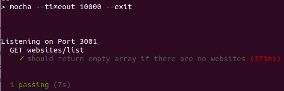
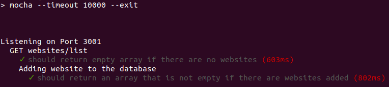
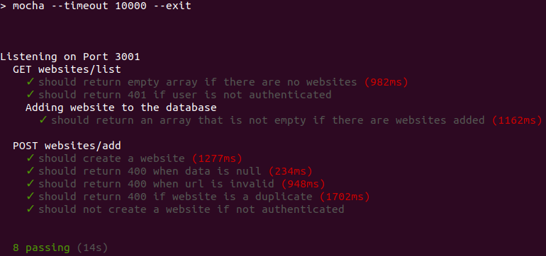

# Task 7 Tutorial

*In this task you will create tests for the APIs you created on **task 6**. You should be familiar with this since you have done before in previous tasks*

##### 1. Set up test files

* Install `chai` `mocha` `chai-http`, in the command line run.
    ```bash
    npm install --save-dev mocha chai chai-http
    ```
* Modify your `package.json` test script.
    ```json
    "scripts": {
        "test": "mocha --timeout 10000 --exit"
      }
    ```
* Create a folder called `test` inside your root folder.
* Inside the `test` folder create a file called `test.js` and copy the following code.
    ```javascript
    const app = require('../index');
    let chai = require('chai');
    let chaiHttp = require('chai-http');
    let expect = chai.expect;
    
    describe('Web monitor tests', () => {
        it('should return 4', done => {
            expect(2 + 2 ).to.equal(4)
            done()
        })
    })
    ```
    *This is a dumb test, just to refresh your mind.*
* On the command line run.
    ```bash
    npm run test
    ```
* You should see something like this.


##### 2. Set up database and enviroment
*Before writting real tests you need to have a separate database and change enviroment variables every time you run tests.*

* Set up the databases.
    ```javascript
    const Sequelize = require('sequelize');
    
    // Create a database variable
    let dbUrl = null;
    
    // Assign dbUrl a value depending on the enviroment process.env.NODE_ENV
    if(process.env.NODE_ENV === 'test') dbUrl = 'your elephant sql database url';
    else {
      dbUrl = 'your local database url';
    }
    
    // Start sequelize with the dbUrl variable
    const sequelize = new Sequelize(dbUrl, {
      // Other code
      }
    });
    
    // Export it
    module.exports = sequelize;
    ```
    *You have done this before so this should look familiar. Remember to protect your databases urls with* `dotenv`.
* On the first line of `test/test.js` assign `process.env.NODE_ENV` to `test`.
    ```javascript
    process.env.NODE_ENV = 'test';
    ```
    *When the server sees this, it will use the* `test` *database.*
* Inside the root folder modify `index.js` to export the server and set the logger to not be used during the tests.
    ```javascript
    // Other code
    app.use(bodyParser.json());
    
    // Don't use logger during tests
    if(process.env.NODE_ENV !== 'test') app.use(logger('tiny'));
    
    // Other code
    app.listen(3001, () => console.log('Listening on Port 3001'));
    
    // Export app for the tests
    module.exports = app;
    ```
*You are good to go now, let's start writting tests!*

##### 3. Tests for websites/list
*Let's start with the* `websites/list` *API*.
* Start with a description for your tests, inside `test/test.js` write.
    ```javascript
    describe('GET websites/list', () => {
        // Nothing for now
    });
    ```
    *All your tests for* `website/list` *will be inside this function.*
* The `website/list` is authenticated, which means you need a token. Inside the `before` hook you will sign up a user, extract the token from the response and assign it to a token variable that will use in our tests.
    ```javascript
    // Other code
    // Declare token variable
    let token = null
    
    describe('GET websites/list', () => {
        // Before hook
        before(done => {
            // Reset database
            sequelize.sync({ force: true })
            .then(() => {
                // Sign up a user
                chai.request(app)
                .post('/users/signup')
                .send({
                    email: 'test@mail.com',
                    password: '123456'
                })
                .end((err, res) => {
                    // Assign token to variable
                    token = `Bearer ${res.body.session}`;
                    // Call done to continue with the test
                    done();
                })
            })
            // Catch any errors
            .catch(err => done(err));
        })
    });
    ```
    *You have your token!*
* Since this user doesn't have any websites added, let's create a test that checks you get an empty array in response when the user doesn't have any websites.
    ```javascript
    // Description
    it('should return empty array if there are no websites', done => {
            // Create the request
            chai.request(app)
            .get('/websites/list')
            // Set our token
            .set('Authorization', token)
            .end((err, res) => {
                // Expect status to be 200
                expect(res.status).to.equal(200);
                // Expect the response to be an empty array
                expect(res.body).to.be.an('array').that.is.empty;
                done();
            })
        })
    ```
* On the command line run `npm run test`, you should see something like this.


* Now for the second test check the  response is not empty when the user actually created websites in the database. Since you need a website already in the database, write another `describe` function and a `before` hook inside it where you will create a new website.
    ```javascript
        // New describe inside GET websites/list
        describe('Adding website to the database', done => {
            // Before hook
            before(done => {
                // Create request
                chai.request(app)
                .post('/websites/add')
                // Use same token for authorization
                .set('Authorization', token)
                .send({
                    name: 'test',
                    url: 'www.test.com'
                })
                .end((err, res) => {
                    // Call done to continue with tests
                    done();
                })
    
            })
        })
    ```
    *You will have a website in the database every time you run this test.* 

* Now that the data is there let's create the test.
    ```javascript
    it('should return an array that is not empty if there are websites added', done => {
        // Create request
        chai.request(app)
        .get('/websites/list')
        // Send token
        .set('Authorization', token)
        .end((err, res) => {
            // Expect status to be 200
            expect(res.status).to.equal(200);
            // Expect an array that is not empty
            expect(res.body).to.be.an('array').that.is.not.empty;
            done();
        })
    })
    ```
* On the command line run `npm run test`, you should see something like this.


*So far so good, now one more test.*

* Let's test the authentication of the route with a test that tries to access without a token. Outside the "Adding website to the database" describe copy the following code.
    ```javascript
    it('should return 401 if user is not authenticated', done => {
        
        chai.request(app)
        .get('/websites/list')
        // No token sent
        .end((err, res) => {
            // Expect status to be 401 (Not Authorized)
            expect(res.status).to.equal(401);
            done();
        })
    })
    ```
    *Yay! You have finished all the tests for* `websites/list`.

###### 4. Tests for websites/add
*Now let's test the route that creates websites entries.*

* Outside all the other describes create a new one for this route.
    ```javascript
    describe('POST websites/add', () => {
    // Nothing for now
    });
    ```
* The first test is very simple, make sure you can create a website.
    ```javascript
    it('should create a website', done => {
            // Create request
            chai.request(app)
            .post('/websites/add')
            .set('Authorization', token)
            .send({
                name: 'Some site',
                url: 'www.site.com'
            })
            .end((err, res) => {
                // Expect response status to be 200
                expect(res.status).to.equal(200)
                done();
            })
        })
    ```
* Return 400 is data is null.
    ```javascript
    it('should return 400 when data is null', done => {
    
            chai.request(app)
            .post('/websites/add')
            .set('Authorization', token)
            // Sending null
            .send(null)
            .end((err, res) => {
                expect(res.status).to.equal(400)
                done();
            })
        })
    ```

* Return 400 if url is invalid. If you haven't already we need to add validation to our Website model. Modify `models/Website.js`.
    ```javascript
    module.exports = (sequelize, DataTypes) => {
      const Website = sequelize.define('Website', {
        name: DataTypes.STRING,
        url: {
          type: DataTypes.STRING,
          // Here we add validation
          validate: {
            isUrl: {
               msg: "URL is not valid"
            }
          }
        },
        status: {
          type: DataTypes.STRING,
          defaultValue: 'online'
        }
      });
      
      // Other code
    
      return Website;
    };
    ```
* Now let's write the test.
    ```javascript
    it('should return 400 when url is invalid', done => {
    
        chai.request(app)
        .post('/websites/add')
        .set('Authorization', token)
        // Send invalid url
        .send({
            name: 'Invalid url',
            url: 'invalid'
        })
        .end((err, res) => {
            // Expect status 400
            expect(res.status).to.equal(400)
            done();
        })
    })
    ```

* Return 400 is website is duplicated.
    ```javascript
    it('should return 400 if website is a duplicate', done => {

        chai.request(app)
        .post('/websites/add')
        .set('Authorization', token)
        // Same website we have in the database
        .send({
            name: 'Some site',
            url: 'www.site.com'
        })
        .end((err, res) => {
            expect(res.status).to.equal(400)
            done();
        })
    })
    ```
* Return 401 is user is not authenticated.
    ```javascript
    it('should not create a website if not authenticated', done => {

        chai.request(app)
        .post('/websites/add')
        .send({
            name: 'Some site',
            url: 'www.site2.com'
        })
        .end((err, res) => {
            expect(res.status).to.equal(401)
            done();
        })
    })
    ```
* On the command line run `npm run test`, you should see something like this.


##### 5. Integrating Travis
*Let's integrate Travis to your project.*

* Add `start` script to your `packcage.json`.
    ```javascript
    "scripts": {
        "test": "mocha --timeout 10000 --exit",
        "start": "node index.js"
      }
    ```
* Inside your root folder create a `.travis.yml` file and copy the following code.
    ```YAML
    language: node_js
    sudo: false
    node_js:
      - "node"
    services:
      - postgresql
    install:
      - "npm install"
    script:
      - "npm test"
    ```
    *This file tells Travis what to do.*
* Push to Github if you haven't already.
* Go to [travis-ci.com](https://travis-ci.com/) and sign up with your Github if you haven't.
* After you gave all the permissions to Travis, click on this repository and see if it passes.
* If you have variables inside `.env` remember to set them in your repository settings inside Travis.

##### 6. Wrapping up.
*Congratulations, you are done! Feel free to add more features or make the app better.*