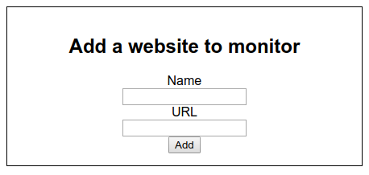
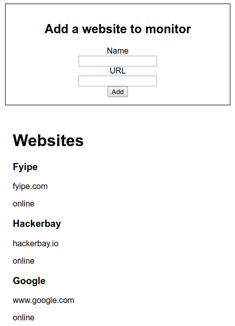

# Task 8 Tutorial

*For this tutorial you will create a dashboard. At this point you should have your backend and frontend connected. If they are not, look back on previous tutorials to learn how to do it. You are building on top of the tasks you've done before, so far you have functional signup and login forms.*

##### 1. Website form
*Let's create your first form that in the future will add websites to the database.*

* Inside the `src/components` create a file called `WebsiteForm.js` and copy the following code.
    ```javascript
    import React from 'react'
    import { Field, reduxForm } from 'redux-form'
    
    let WebsiteForm = props => {
      const { handleSubmit } = props
    
      return (
        <form onSubmit={handleSubmit}>
          <h2>Add a website to monitor</h2>
          <div>
                <label htmlFor="name">Name</label>
                <br/>
                <Field name="name" component="input" type="text" />
            </div>
            <div>
                <label htmlFor="url">URL</label>
                <br/>
                <Field name="url" component="input" type="text" />
            </div>
            <button type="submit">Add</button>
        </form>
        )
    }
    
    WebsiteForm = reduxForm({
      form: 'websiteForm'
    })(WebsiteForm)
    
    export default WebsiteForm
    ```
    *Before bringing* `Website.js` *to your app you need to find a place to store the user information.*

##### 2. The user reducer
*Let's create a reducer that will store the user status and websites.*

* Inside `scr/reducers` create a file called `user.js`.
    ```javascript
    import { LOGIN } from '../actions';
    
    let initialState = {
      isLoggedIn: false,
      websites: []
    }
    
    const user = (state = initialState, action) => {
        switch(action.type) {
            case LOGIN:
                return state = {...state, isLoggedIn: action.payload };
            default:
                return state;
        }
    }
    
    export default user
    ```
* Add the `user.js` to the `rootReducers`, inside `src/reducers/index/js` add the following code.
    ```javascript
    // Other code
    import user from './user';
    
    const rootReducers = combineReducers({
        form: formReducer,
        user
    });
    // Other code
    ```
    *The user reducer stores the status (logged in or not) and the websites the user has created. Now there is a* `LOGIN` action *you haven't created yet, let's fix that.*
* Inside `src/actions/index.js` copy the following code.
    ```javascript
    export const LOGIN = 'LOGIN';
    
    export function loginUser() {
        return {
            type: LOGIN,
            payload: true
        }
    }
    ```
    *Now let's connect the store to `App.js`*

##### 3. mapStateToProps
`mapStateToProps` *connects the component to the redux store, let's connect* `App.js` *so it has access to the user reducer.*

* Inside `src/App.js` add the following code.
    ```javascript
    // Other code
    
    class App extends Component {
    //Other code
    }
    
    // Where the magic happens
    const mapStateToProps = state => {
      return {
        // Pull data from the store
        user: state.user
      }
    }
    
    // connect "connects" the component to the store
    export default connect(mapStateToProps)(App);
    ```
    *Now `App.js` will be aware of changes in the user reducer.*
    
##### 4. mapDispatchToProps
`mapDispatchToProps` *works in a similar as* `mapStateToProps` *but instead of the store, we are importing actions. Let's import the* `loginUser()` *action*.
* Inside `App.js` add following code.
    ```javascript
    // Other code
    // Import action 
    import { loginUser } from './actions/index';
    
    class App extends Component {
    // Other code
    }
    
    // Other code
    
    // Specify actions to import
    const mapDispatchToProps = {
      loginUser
    }
    
    // Connect now has two arguments
    export default connect(mapStateToProps, mapDispatchToProps)(App);
    ```
    *Now* `App.js` *can call actions and mutate the store.*

##### 5. Routing and protecting routes
*Let's redirect your users to* `WebsiteForm.js` *upon a succesful login. You will use the `isLoggedIn` prop to redirect the user to the rigth page.*
* Inside `src/App.js` add the following code.
    ```javascript
    // Other code
    import WebsiteForm from './components/WebsiteForm';
    import { loginUser } from './actions/index';
    
    class App extends Component {
    
      // Bind them so these function can access "this"
      signup = this.signup.bind(this);
      login = this.login.bind(this);
      
      // Sign up function
      signup (values) {
        // Send request to backend
        axios.post('/users/signup', values)
        // If succesful dispatch action to log in user
        .then(res => {
            // Store token in session storage
            sessionStorage.setItem('token', `Bearer ${res.session}`);
            // Dispatch loginUser action
            this.props.loginUser();
        })
        // If not succesful log error
        .catch(err => console.log(err.response.data));
      }
      // Sign up function
      login (values) {
        // Send request to backend
        axios.post('/users/login', values)
        // If succesful dispatch action to log in user
        .then(res => {
            // Store token in session storage
            sessionStorage.setItem('token', `Bearer ${res.session}`);
            // Dispatch loginUser action
            this.props.loginUser();
        })
        // If not succesful log error
        .catch(err => console.log(err.response.data));
      }
    
      render() {
        return (
          <Router>
            <div>
              {/* Render <WebsiteForm/> if user is logged in */}
              <Route exact path="/" render={() => {
                return this.props.user.isLoggedIn ? 
                <WebsiteForm/>
                :
                <Signup onSubmit={this.signup} />
              }} />
              {/* Render <WebsiteForm/> if user is logged in */}
              <Route path="/login" render={() => {
                return (
                  this.props.user.isLoggedIn ?
                  <WebsiteForm />
                  :
                  <Login onSubmit={this.login}/>
                  )
              }} />
            </div>
          </Router>
        );
      }
    }
    
    // Other code
    
    export default connect(mapStateToProps, mapDispatchToProps)(App);
    ```
    
* Let's style your form a little bit, inside `src/App.css` copy the following code.
    ```css
    form {
      border: solid 1px black;
      padding: 15px;
      margin: 15px;
      width: 30vw;
      text-align: center;
    }
    ```
    
* On the command line run.
    ```bash
    npm start
    ```
    *You should see something like this. After succesfully logging in.*
    
    

##### 6. Making Website interactive
*Let's make* `Website.js` *be able to dispatch actions, access the store and send requests.*

* Create a `addWebsite()` function that will fire when a website is submitted.
* Inside `src/App.js` add the following code.
    ```javascript
    // Other code
    
    class App extends Component {
      
      // Other code
      // Website function
      addWebsite (values) {
        // Get token from session storage
        let token = sessionStorage.getItem('token');
        
        // Request to the backend with values from the form
        axios.post('/websites/add',
                  values,
                  { headers: {
                    // Send token auth
                    "Authorization": token
                  }
        })
        // Alert if successful
        .then(website => alert('Website added.'))
        // Alert if error
        .catch(err => alert(err.response.data.msg));
      }
    
      render() {
        return (
          // Other code
        );
      }
    }
    
    // Other code
    
    export default connect(mapStateToProps, mapDispatchToProps)(App);
    ```
* Inside `src/App.js` add `addWebsite` to `onSubmit` in the `Website` component.
    ```javascript
    <WebsiteForm onSubmit={this.addWebsite}/>
    ```
*Now the user can add websites to the databases. You don't see anything for now, you will work on that now.*


##### 7. Get websites from user
*Users should be able to see the websites they have already added to the database. Add a* `getWebsites` *action that will retrieve all the websites from a specific user.*

* Inside `src/actions/index.js` create a new action that will interact with the user's websites arrays.
    ```javascript
    export const LOGIN = 'LOGIN';
    // Declare your action type
    export const WEBSITES = 'WEBSITES';
    
    // Other code
    
    export function getWebsites(websites) {
        // This action will take the websites list and send it to the reducer
        return {
            type: WEBSITES,
            payload: websites
        }
    }
    ```
* Now make your user reducer react to the `WEBSITES` action. Inside `src/reducers/user.js`.
    ```javascript
    // import the WEBSITE type
    import { LOGIN, WEBSITES } from '../actions';
    
    // Other code
    
    const user = (state = initialState, action) => {
        switch(action.type) {
            case LOGIN:
                return state = {...state, isLoggedIn: true };
            // If WEBSITES update the websites property
            case WEBSITES:
              return state = {...state, websites: action.payload.data };
            default:
                return state;
        }
    }
    
    export default user
    ```

*The logic is to create two components, one called* `WebsiteList` *that will contain a list with all the users websites, the other component will be* `Website` *which will be a representation of each individual website.*

* Inside `src/components` create a file called `Website.js` and add the following code.
    ```javascript
    import React from 'react';
    
    const Website = ({ name, url, status }) => (
      <div>
        <h3>{name}</h3>
        <p>{url}</p>
        <p>{status}</p>
      </div>
      )
    
    export default Website;
    ```
    *This is component is expecting some specific data that you will provide inside* `WebsiteList`, *let's create it.*
    
* Inside `src/components` create a file called `WebsiteList.js` and copy the following code.

    ```javascript
    import React, { Component } from 'react';
    import { connect } from 'react-redux';
    import axios from 'axios';
    
    // Import action
    import { getWebsites } from '../actions';
    import Website from './Website';
    
    class WebsiteList extends Component {
    
        // Call function after component mounts
      componentDidMount(){
          // Get token from session storage
        let token = sessionStorage.getItem('token');
        
        // Request websites from backend
        axios.get('/websites/list', { headers: { 'Authorization': token } })
        .then(websites => {
            // Dispatch the action with the websites received
          this.props.getWebsites(websites)
        })
        .catch(err => alert(err.response.data.msg));
      }
    
      render() {
        return (
          <div className="websites">
            <h1>Websites</h1>
            {/* Create a Website component for every website in the store, pass all the properties */}
            {
              this.props.user.websites.reverse().map(website => 
                <Website
                key={website.id}
                name={website.name}
                url={website.url}
                status={website.status}
                />
                )
            }
          </div>
        );
      }
    }
    
    // Bring the user reducer to the component
    const mapStateToProps = state => {
      return {
        user: state.user
      }
    }
    
    // Bring the getWebsites action to the component
    const mapDispatchToProps = {
      getWebsites
    }
    
    // Connect to the store
    export default connect(mapStateToProps, mapDispatchToProps)(WebsiteList);
    ```
    
    *So basicallt this component is returning a list of Websites components.*

* Now add `WebsiteList.js` to the main app. Inside `src/App.js` add the following code.
    ```javascript
    // Other code
    
    // Import WebsiteList component
    import WebsiteList from './components/WebsiteList';
    // Import getWebsites action to update websites after adding one
    import { loginUser, getWebsites } from './actions/index';
    
    class App extends Component {
    
      addWebsite (values) {
        let token = sessionStorage.getItem('token');
        axios.post('/websites/add',
                  values,
                  { headers: {
                    "Authorization": token
                  }
        })
        .then(website => {
          alert('Website added.')
          // Request websites from backend
          axios.get('/websites/list', { headers: { 'Authorization': token } })
          .then(websites => {
            // Call getWebsites to refresh the list everytime we add a website
            this.props.getWebsites(websites)
          })
        })
        .catch(err => alert(err.response.data.msg));
      }
    
      render() {
        return (
          <Router>
            <div>
              <Route exact path="/" render={() => {
                return this.props.user.isLoggedIn ?
                <React.Fragment>
                  {/* Add WebsiteList here */}
                  <WebsiteForm onSubmit={this.addWebsite}/>
                  <WebsiteList/>
                </React.Fragment>
                :
                <Signup onSubmit={this.signup} />
              }} />
              <Route path="/login" render={() => {
                return (
                  this.props.user.isLoggedIn ?
                  <React.Fragment>
                    {/* Add WebsiteList here */}
                    <WebsiteForm onSubmit={this.addWebsite}/>
                    <WebsiteList/>
                  </React.Fragment>
                  :
                  <Login onSubmit={this.login}/>
                  )
              }} />
            </div>
          </Router>
        );
      }
    }
    
    const mapStateToProps = state => {
      return {
        user: state.user
      }
    }
    
    // Remember to add getWebsites here
    const mapDispatchToProps = {
      loginUser,
      // Add getWebsites
      getWebsites
    }
    
    export default connect(mapStateToProps, mapDispatchToProps)(App);
    ```

*Now the users can login or signup, add websites and see the websites they already have.*



##### 8. Add log out
*Let's add a logout function that will erase the user's information from the session storage and redirect to Login.*

* Let's create an action that will logout our user. Inside `src/components/actions` add the following code.
    ```javascript
    // Other code
    // Declare logout type
    export const LOGOUT = 'LOGOUT';
    
    // Other code
    
    // Behold the logout action
    export function logout() {
      return {
        type: LOGOUT,
        payload: false
      }
    }
    ```
* Now let's tell the user reducer what to do with this action. Inside `src/reducers/user.js` add the following code.
    ```javascript
    // Add the LOGOUT type
    import { LOGIN, WEBSITES, LOGOUT } from '../actions';
    
    // Other code
    
    const user = (state = initialState, action) => {
        switch(action.type) {
        
            // Other code
            
            // Change isLoggedIn to false
            case LOGOUT:
                return state = {...state, isLoggedIn: action.payload };
            default:
                return state;
        }
    }
    
    export default user
    ```
    
* Time to implement this action inside our app. Inside `src/components/WebsiteForm.js` add the following code.

    ```javascript
    // Connect form to redux store
    import { connect } from 'react-redux';
    // Import logout action
    import { logout } from '../actions';
    
    let WebsiteForm = props => {
      const { handleSubmit } = props
        
        // Logout function
      function logout () {
          // Clear session storage
        sessionStorage.clear();
        // Dispatch logout action
        props.logout();
      }
    
      return (
        <form onSubmit={handleSubmit}>
          <h2>Add a website to monitor</h2>
          {/* Add a button with an onClick function */}
          <button type="button" onClick={logout}>Logout</button>
          <div>
                <label htmlFor="name">Name</label>
                <br/>
                <Field name="name" component="input" type="text" />
            </div>
            <div>
                <label htmlFor="url">URL</label>
                <br/>
                <Field name="url" component="input" type="text" />
            </div>
            <button type="submit">Add</button>
        </form>
        )
    }
    
    // Bring logout action to props
    const mapDispatchToProps = {
      logout
    }
    
    // Connect form to redux store
    WebsiteForm = connect(
        null,
        mapDispatchToProps
    )(WebsiteForm);
    
    export default reduxForm({
        form: 'websiteForm'
    })(WebsiteForm);
    ```

*Great, now the users can log out.*

##### 9. Wrapping up
*Good job, your app is fully functional. Spend some time making it look better with some CSS, implement some new features and fix any bugs that you may encounter. Have fun and keep coding!*